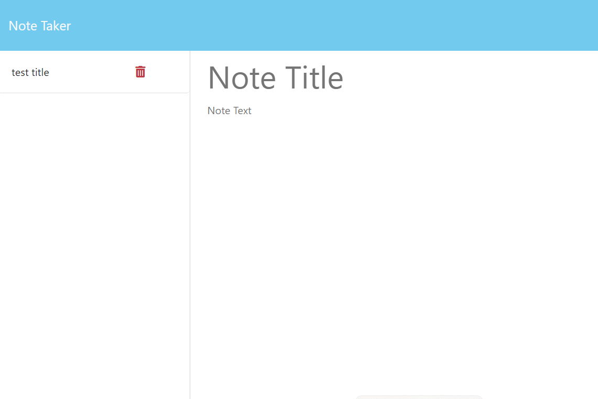
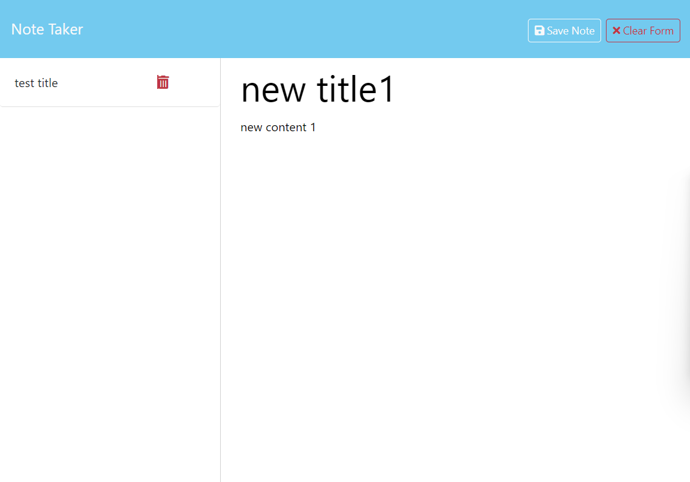
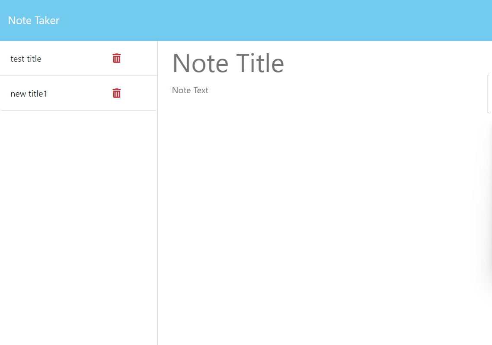

# Note Taker 

## Description

This web-based note taker was created using front-end webpage and back-end server by ylf456.

## Installation

Using this app through the Heroku link: Any web browser. link: https://note-taker-ylf456-a117f21be022.herokuapp.com/

To test the code on the back-end: Web broswer, Javascript, node.js and node packages(express.js). 

## Usage

To use this app, click the 'Get started' button in the middle of the index page. You will then be directed to the note-taker page.

On the note-taker page, you can save notes on the left side. Click on a saved note to display it on the right side.

To create a new note, enter a value in the note title and note text area. Then, click the 'Save Note' button in the top right corner.

If you want to delete a saved note, go to the note list and click on the trash icon next to the note you want to delete.

## Credits

N/A

## License

N/A

## Link to this application

Link to this Repo: https://github.com/ylf456/module-11-challenge-ylf456-Note-Taker.git

Heroku Deployment link : https://note-taker-ylf456-a117f21be022.herokuapp.com/

## Screenshots

